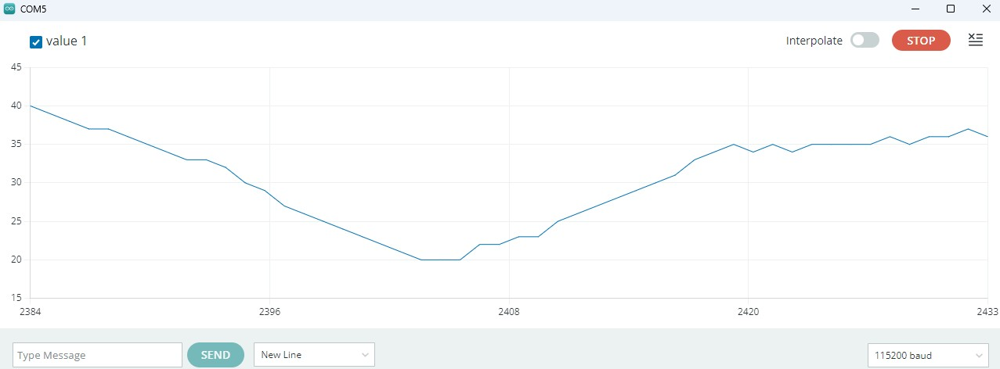
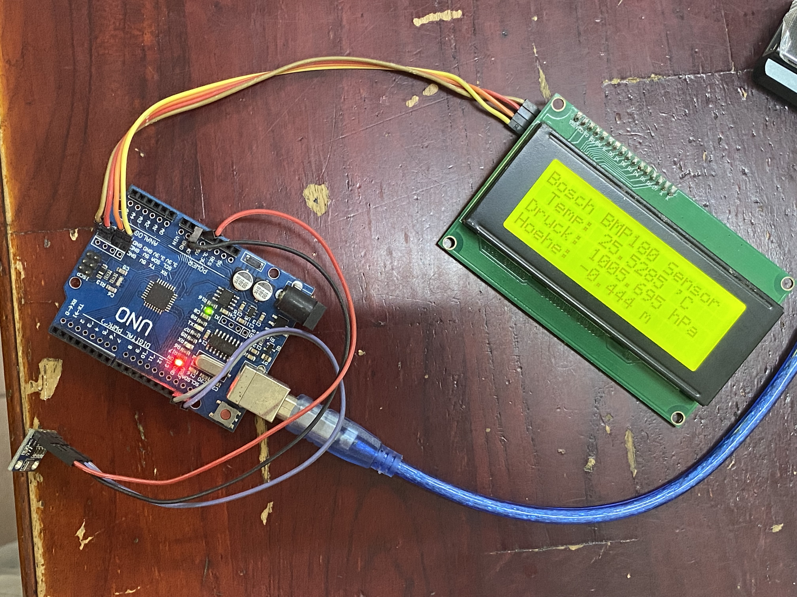

# Ultrasonic Distance Measurement


Initially I started this project in January 2016 with an Arduino and a 1602 display. 2019 it was on display at AISVN. In 2026 students at the Marie Curie school in Saigon learn about it. The original code is located at [407B/ultrasonic](https://github.com/kreier/407B/blob/master/ultrasonic/ultrasonic_lcd2004_en.ino).

## Latest edition 5th October 2026

It works now with uptime timer and proximity sensor:


Here is the current code:

``` c
// 2019-10-25 https://github.com/kreier/407B/blob/master/ultrasonic/ultrasonic_lcd2004_en.ino
// 2026-10-05 https://github.com/marie-curie-stem/arduino/tree/main/examples/ultrasonic_lcd2004_en

#include <Wire.h>
#include <hd44780.h>
#include <hd44780ioClass/hd44780_I2Cexp.h> // include i/o class header
#include <NewPing.h>

#define  TRIGGER_PIN   11
#define  ECHO_PIN      10
#define  MAX_DISTANCE 350 // Maximum distance we want to ping for (in centimeters).
                          // Maximum sensor distance is rated at 400-500cm.
#define  PROXIMITY      8 // IR proximity sensor is connected to this pin
#define  LED           13

int DistanceIn;
int DistanceCm;

unsigned long time; // runs over after 4294967295 milliseconds or 49days 17:02:47.295
unsigned long runtime; // seconds this system actually runs
int rollover = 0;
int days    = 0;
int hours   = 0;
int minutes = 0;
int seconds = 0;
char block = 255;
uint32_t counter = 0;

NewPing sonar(TRIGGER_PIN, ECHO_PIN, MAX_DISTANCE);

hd44780_I2Cexp lcd; // declare lcd object: auto locate & config display for hd44780 chip

void setup()
{
  Serial.begin(115200);  // start serial to PC
  Serial.println("Ultrasonic Distance Measurement");  
  pinMode(LED, OUTPUT); // for status LED
  pinMode(PROXIMITY, INPUT);
  time = millis();
  
  // initialize LCD with number of columns and rows:
  lcd.begin(20, 4);

  // Print a message to the LCD
  lcd.setCursor(0,0);  
  lcd.print("uptime 00d 00:00:00 ");
  lcd.setCursor(0,1); 
  lcd.print("ultrasonic distance:");
}

void uptime() {
  if( millis() - time < 0 ) { // rollover happened after unsigned long 4294967295 milliseconds = 49.71 days
    time = millis();
    rollover++;
  }
  runtime = 4294967*rollover + time/1000;
  //lcd.setCursor(0,1);
  //lcd.print(runtime);
  //lcd.print("  ");
  days = runtime / 86400;
  hours = (runtime - days*86400) / 3600;
  minutes = (runtime - days*86400 - hours*3600) / 60;
  seconds = (runtime - days*86400 - hours*3600 - minutes*60);
  lcd.setCursor(0, 0);
  lcd.print("uptime ");
  lcd.print(days);
  lcd.print("d ");
  print2dig(hours);
  lcd.print(":");
  print2dig(minutes);
  lcd.print(":");
  print2dig(seconds);
  lcd.print(" ");
  time = millis();
}

void distance() {
   DistanceIn = sonar.ping_in();
   lcd.setCursor(0,2); 
   lcd.print("Ping: ");
   lcd.print(DistanceIn);  // converts ping time to distance and writes to serial 
                           // (0 = outside set distance range, no ping echo)
   lcd.print(" in   ");
  
   //delay(100);  waits 100 milliseconds between pings. 29 milliseconds is the shortest delay between 2 pings
   DistanceCm = sonar.ping_cm(); // 10 pings per second
   lcd.setCursor(0,3);
   lcd.print("Ping: ");
   lcd.print(DistanceCm); 
   lcd.print(" cm  ");
   // counter += 1;
   // if ((counter % 2) == 0) Serial.println(DistanceCm); // for less frequent ultrasonic values
   Serial.println(DistanceCm);
}

void print2dig (int number) {
  if (number < 10) {
    lcd.print("0");
  }
  lcd.print( number );
}

void proximity() {
  lcd.setCursor(12,2);
  block = 255;
  if( digitalRead(PROXIMITY) == 1) block = 160;
  for(int z=0 ; z < 8; z++) lcd.write(block);
}

void loop()
{
  distance();
  proximity();
  uptime();
  delay(100);   // waits 100 milliseconds between pings. 29 milliseconds is the shortest delay between 2 pings
}

```

We updated to a output stream of distance centimeter data, so you can use the integrated plotter of the Arduino IDE:



## New school September 2026

7 years later I handed over this project to the Marie Curie Stem department. The color of the 2004 display changed, it has an infrared proximity sensor and a uptime timer running at the same time:



Here is the current code, the HD library can probably be replaced by the `LiquidCrystal` library for both the I2C bridge and the LCD driver.

``` c
#include <Wire.h>
#include <hd44780.h>
#include <hd44780ioClass/hd44780_I2Cexp.h> // include i/o class header
#include <NewPing.h>

#define  TRIGGER_PIN  11
#define  ECHO_PIN     10
#define MAX_DISTANCE 350 // Maximum distance we want to ping for (in centimeters).
                         // Maximum sensor distance is rated at 400-500cm.

NewPing sonar(TRIGGER_PIN, ECHO_PIN, MAX_DISTANCE);

int DistanceIn;
int DistanceCm;

hd44780_I2Cexp lcd; // declare lcd object: auto locate & config display for hd44780 chip

void setup()
{
  Serial.begin(57600);  // start serial to PC
  Serial.println("Ultrasonic Distance Measurement");  
  pinMode(13, OUTPUT); // for status LED
  // initialize LCD with number of columns and rows:
  lcd.begin(20, 4);

  // Print a message to the LCD
  lcd.setCursor(1,0);  
  lcd.print("Ultrasonic Distance");
  lcd.setCursor(0,1); 
  lcd.print("The distance is:");
}

void loop()
{
   delay(100);   // Wartet 100 Milisekunden zwischen den Pings (ca. 10 Pings pro Sekunde). 29 Millisekunden ist der kürzest mögliche Delay zwischen zwei Pings.
   DistanceIn = sonar.ping_in();
   lcd.setCursor(0,2); 
   lcd.print("Ping: ");
   lcd.print(DistanceIn);  // Konvertiert die Ping Zeit in die Entfernung und gibt das Resultat über die Serielleschnittstelle zurück 
                            // (0 = outside set distance range, no ping echo)
   lcd.print(" in     ");
  
   delay(100);  // Wartet 100 Milisekunden zwischen den Pings (ca. 10 Pings pro Sekunde). 29 Millisekunden ist der kürzest mögliche Delay zwischen zwei Pings.
   DistanceCm = sonar.ping_cm();
   lcd.setCursor(0,3);
   lcd.print("Ping: ");
   lcd.print(DistanceCm); 
   lcd.print(" cm  ");  
}
```

## Update October 2019

I upgraded to a larger 2004 display and placed it on a desk in front of room 407B at AISVN, American School Vietnam in Nha Be. Documentation done on 18.10.2019.


